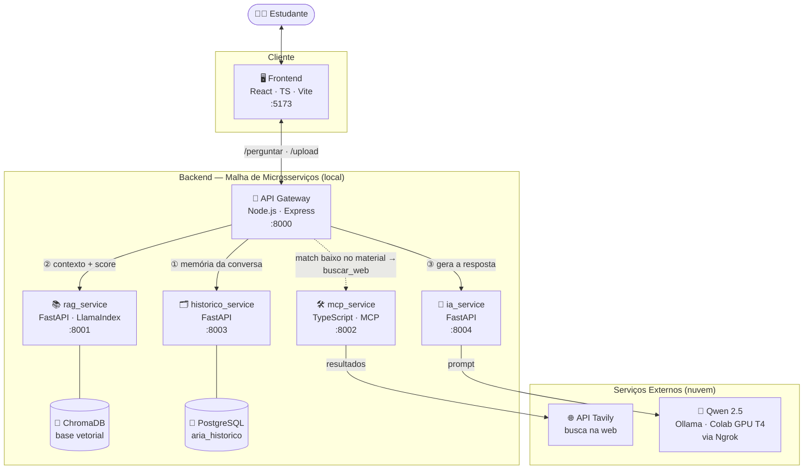

# 🧠 Assistente Acadêmico Inteligente (RAG + MCP)

Trabalho prático desenvolvido para a disciplina **GCC129 - Sistemas Distribuídos** da Universidade Federal de Lavras (UFLA), sob orientação do Prof. André de Lima Salgado.

> **Status:** Fase 3 - Concluída (Arquitetura Expandida e Integração de Serviços)

## 📌 Objetivo do Projeto
Este projeto implementa um sistema inteligente, distribuído e escalável para atuar como um **Assistente Acadêmico**. Ele utiliza a arquitetura RAG (*Retrieval-Augmented Generation*) integrada ao MCP (*Model Context Protocol*) para responder a dúvidas de alunos com base em documentos reais fornecidos pelos professores, contornando alucinações de IA e garantindo respostas rigorosamente fundamentadas em arquivos institucionais.

---

## 🏗️ Arquitetura do Sistema
Na Fase 3, o ecossistema migrou de uma estrutura de acoplamento parcial para uma malha de microsserviços altamente especializada e resiliente, composta por 7 componentes:



> 🧭 **Fluxo de uma pergunta:** o Gateway busca a **memória** no Histórico → pede **contexto + score** ao RAG → se o material for relevante, manda o IA **gerar** a resposta com os PDFs; caso contrário, aciona o MCP (`buscar_web` via Tavily) e então o IA gera a resposta com os resultados da web. O IA conversa com o **Qwen 2.5** hospedado no Colab.

1. **Frontend (React / TypeScript / Vite):** Interface gráfica de usuário (App do Estudante) onde as perguntas são feitas e o histórico de interações é renderizado em tempo real.
2. **API Gateway (Node.js / Express):** Ponto de entrada único e centralizado do backend (porta `8000`). Gerencia as políticas de roteamento e distribui as chamadas de forma transparente.
3. **Servidor MCP (`mcp_service` - Node.js / TypeScript):** Componente migrado para TypeScript que expõe as ferramentas do sistema. Além da consulta local (`consultar_documentos_aula`), **agora integra APIs externas para conectar a IA à internet**, permitindo buscas na web em tempo real e orquestrando a injeção desse contexto dinâmico para os modelos de linguagem.
4. **Microsserviço RAG (`rag_service` - Python / FastAPI / LlamaIndex):** Responsável pelo processamento, chunking e indexação dos PDFs locais, alimentando e persistindo os embeddings no banco de dados vetorial.
5. **Microsserviço de IA (`ia_service` - Python / FastAPI):** Camada dedicada exclusivamente para isolar e gerenciar as chamadas externas, o consumo e o processamento de prompts junto aos modelos de linguagem.
6. **Microsserviço de Histórico (`historico_service` - Python / FastAPI):** Responsável por gerenciar o estado, a persistência e a recuperação cronológica do contexto de conversação de cada estudante.
7. **Infraestrutura LLM (Google Colab / Ngrok / Ollama):** Execução do modelo de linguagem **Qwen 2.5** utilizando aceleração por hardware (GPU T4 na nuvem) via Ollama, comunicando-se com o ecossistema local por meio de um túnel reverso seguro gerado pelo Ngrok.

---

## 📂 Estrutura do Repositório (Monorepo)

```bash
/
  ├── api_gateway/           # Roteamento central e orquestração de chamadas (Node.js)
  ├── documentos/            # Base de conhecimento (PDFs e manuais institucionais)
  ├── frontend/              # Interface web SPA do estudante (React + TS)
  ├── historico_service/     # Microsserviço de persistência de contexto (Python)
  ├── ia_service/            # Microsserviço de isolamento da camada de LLM (Python)
  ├── mcp_service/           # Servidor de ferramentas em Model Context Protocol (TypeScript)
  ├── rag_service/           # Engine de busca vetorial e banco persistido ChromaDB (Python)
  ├── arquitetura_fase3.jpg  # Diagrama visual da arquitetura
  ├── codigos_colab.pdf      # Instruções para subir o LLM (Qwen) no Google Colab
  ├── Relatório.pdf          # Relatório do trabalho
  ├── Documentacão.pdf       # Documentação técnica do projeto
  └── README.md              # Este arquivo
```

---

## 🚀 Novidades Técnicas da Fase 3
Em relação à fase anterior, as seguintes melhorias de engenharia de software distribuído foram consolidadas:
* **Desacoplamento de Escopo:** Separação das responsabilidades de IA e Histórico de Sessão da antiga rota do RAG para microsserviços Python independentes (`ia_service` e `historico_service`).
* **Tipagem Estrita no Contrato de Ferramentas:** Migração da infraestrutura do `mcp_service` de JavaScript puro para TypeScript, garantindo maior segurança em tempo de compilação para os schemas do protocolo MCP.
* **Persistência de Embeddings:** Consolidação física da base vetorial do ChromaDB (`chroma_db/`) e metadados de armazenamento (`storage/`), permitindo que as consultas ocorram de forma instantânea sem necessidade de reindexar os documentos a cada inicialização.
* **Ampliação do Contexto:** Expansão da base de documentos para o módulo de infraestrutura, incluindo manuais avançados de redes sem fio.
* **Conexão Externa (Internet):** Implementação de ferramentas via API no MCP que quebram o isolamento da LLM, permitindo que a IA realize pesquisas na web em tempo real para complementar respostas com informações atualizadas fora do RAG local.

---

## 🛠️ Como Executar o Projeto

Por se tratar de uma arquitetura de múltiplos microsserviços distribuídos, cada componente deve ser iniciado em uma aba de terminal dedicada. Siga a ordem recomendada de inicialização:

### Passo 1: Provisionamento do Modelo na Nuvem (LLM Backend)
1. Abra o arquivo `codigos_colab.pdf` e utilize as instruções para rodar o notebook na nuvem do Google Colab.
2. Certifique-se de selecionar o ambiente com GPU (T4 ou superior).
3. Execute todas as células para iniciar o Ollama, carregar a LLM e ativar o tunelamento do Ngrok.
4. Copie a URL pública gerada (ex: `https://xxxx-xx-xx.ngrok-free.app`).

### Passo 2: Configuração dos Ambientes (.env)
Antes de ligar os serviços, atualize os arquivos `.env` dentro das pastas `rag_service`, `ia_service` e `historico_service` colando a URL gerada pelo Ngrok no campo correspondente à comunicação com o modelo de linguagem.

> **⚠️ Pré-requisito (Banco de Dados):** O `historico_service` persiste as conversas em um banco **PostgreSQL**. Antes de iniciá-lo, garanta que haja uma instância do PostgreSQL em execução em `localhost:5432` com o banco `aria_historico` disponível (a conexão padrão usa o usuário/senha `postgres`/`postgres`, sobrescrevível via variável `DATABASE_URL` no `.env`).
>
> **🌐 Busca na Web (Tavily):** Para que a IA consiga buscar informações atualizadas na internet, defina a variável `TAVILY_API_KEY` no arquivo `.env` do `mcp_service` (use o `mcp_service/.env.example` como base). Sem essa chave, a ferramenta `buscar_web` fica indisponível e o sistema responde apenas com base nos PDFs.

### Passo 3: Inicialização dos Serviços em Python
Abra terminais separados para cada serviço e execute:

* **Microsserviço RAG:**
```bash
  cd rag_service
  uvicorn main:app --port 8001 --reload
  ```
* **Microsserviço de IA:**
```bash
  cd ia_service
  uvicorn main:app --port 8004 --reload
  ```
* **Microsserviço de Histórico:**
```bash
  cd historico_service
  uvicorn main:app --port 8003 --reload
  ```

### Passo 4: Inicialização dos Serviços em Node.js / TypeScript
Abra novos terminais para rodar os servidores da camada de aplicação:

* **Servidor MCP:**
```bash
  cd mcp_service
  npm install
  npm run dev
  ```
* **API Gateway:**
```bash
  cd api_gateway
  npm install
  npm start
  ```

### Passo 5: Inicialização da Interface Visual
No último terminal, ligue a camada cliente:
```bash
cd frontend
npm install
npm run dev
```
Acesse o endereço fornecido no terminal (geralmente `http://localhost:5173/`) no seu navegador web para interagir com o ecossistema completo.

---

## 👥 Equipe e Atribuições
* **Pyêtro Augusto Malaquias** 
* **Lídio Júnior Pereira Batista**
* **Helder Jose Ávila** 
* **Gustavo Batista Bissoli**
* **Miguel Chagas Figueiredo** 
